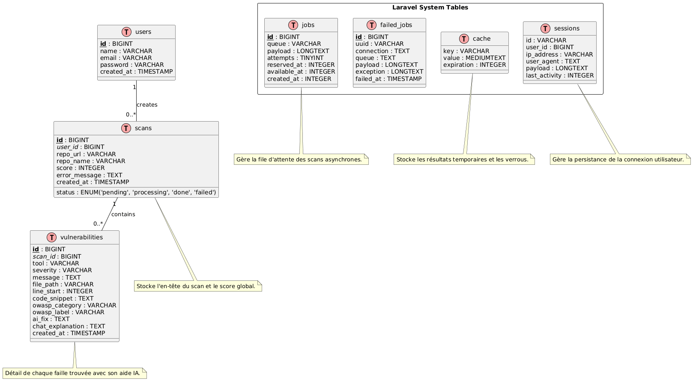

# 📘 Documentation Technique — SecureScan

> **Ressources Complémentaires :**
> - 📄 [Architecture de Base de Données](./database_architecture.md)
> - 🏗️ [Architecture Application](./app_architecture.md)
> - 📖 [Référence Projet Globale](./REFERENCE_PROJET.md)

---

## 1. Architecture Globale

SecureScan repose sur une architecture **MVC (Model-View-Controller)** moderne, renforcée par une **couche de Services** pour la logique métier et un **système de Queues** pour les traitements asynchrones.

### Pile Technologique
- **Framework Backend** : Laravel 12 (PHP 8.3)
- **Base de Données** : MySQL 8.0 / SQLite (tests)
- **Gestionnaire de tâches** : Laravel Queues (Database driver)
- **Frontend** : Blade (Templating), Tailwind CSS (Design), Alpine.js (Interactivité légère)
- **Génération PDF** : `barryvdh/laravel-dompdf` pour l'export de rapports complets
- **IA** : Google Gemini 2.5 Flash via API REST

---

## 2. Design & Interface (UX/UI)

Le développement de SecureScan a suivi une approche centrée sur l'utilisateur, articulée autour de trois étapes clés : le **zoning** (structure brute), le **wireframe** (mise en page détaillée) et la **capture finale** (interface réelle).

### 📐 Évolution des Écrans Principaux

#### 🏠 Page d'Accueil
| Zoning | Wireframe | Rendu Final |
| :---: | :---: | :---: |
|  |  |  |

#### 📊 Dashboard (Analyse en direct)
| Zoning | Wireframe | Rendu Final |
| :---: | :---: | :---: |
|  |  |  |

#### 📁 Mes Scans (Historique)
| Zoning | Wireframe | Rendu Final |
| :---: | :---: | :---: |
|  |  |  |

#### ⚙️ Paramètres
| Zoning | Wireframe | Rendu Final |
| :---: | :---: | :---: |
|  |  |  |

---

## 3. Organisation du Code

### Modèles (`app/Models`)
- **User** : Gère l'authentification et l'historique personnel.
- **Scan** : Entité principale représentant une analyse. Contient le score, le statut (`pending`, `processing`, `done`, `failed`) et les métadonnées du repo.
- **Vulnerability** : Détail d'une faille trouvée. Stocke le lien OWASP, les correctifs IA et les explications générées.

### Services Outils de Scan (`app/Services`)
Afin d'adopter une réelle **Approche Multi-Scanner**, le moteur s'appuie sur des classes isolées ayant la responsabilité d'un outil précis :
- **`SemgrepService`** : Analyse statique profonde des codes sources.
- **`NpmAuditService`** : Évaluation précise des vulnérabilités dans les dépendances JS.
- **`BanditService` / `EslintService`** : Scanners spécialisés par langages/environnements.
- **`TruffleHogService`** : Détecteur impitoyable de secrets potentiellement fuités.

### Services Métier Complémentaires (`app/Services`)
La logique métier est isolée dans d'autres services pour rester "DRY" et testable :
- **`OwaspMapperService`** : Cerveau orchestrateur qui traduit les tags disparates (Semgrep, npm, etc.) en catégories universelles **OWASP Top 10 : 2025**.

#### 📂 Logique de Mapping OWASP
Le système normalise les vulnérabilités selon la grille suivante pour assurer une lecture transverse :

| Outil / Type de Faille | Mots-clés / Signal | Catégorie OWASP |
| :--- | :--- | :--- |
| **npm audit** | Dépendances obsolètes | `A06:2025 – Vulnerable Components` |
| **TruffleHog** | Clés API, Secrets, Passwords | `A08:2025 – Software Integrity Failures` |
| **Scripts (SQLi / XSS)** | `sql`, `eval()`, `script` | `A03:2025 – Injection` |
| **Crypto / SSL** | `http://`, `md5`, `ssl` | `A02:2025 – Cryptographic Failures` |
| **Permissions** | `auth`, `access`, `chmod` | `A01:2025 – Broken Access Control` |
| **Par défaut** | Autres configurations | `A05:2025 – Security Misconfiguration` |
- **`GitHubPRService`** : Gère l'interaction complexe avec l'API GitHub (Branches, Commits, PRs).
- **`GitCloneService`** : Encapsule les commandes système `git` de manière sécurisée.

### Services IA : Séparation Cache / Chat
- **`AiFixService`** : Appelé une première fois pour générer une explication/correction immédiate de la vulnérabilité globale. Le résultat est *mis en cache* en base de données pour préserver nos quotas et accélérer l'interface utilisateur.
- **`AiChatService`** : Fournit une intelligence conversationnelle contextuelle et en direct avec l'utilisateur via le `ChatController`, indépendamment du cache.

---

## 4. Flux de Données (Interaction)

### Le cycle d'un Scan
1. **Lancement** : L'utilisateur soumet une URL GitHub via `ScanController@store`.
2. **Asynchronisme** : Un job `RunSecurityScanJob` est poussé dans la queue. La vue `loading` fait du "polling" sur l'état du scan.
3. **Analyse Multi-outils** : Le job exécute successivement nos Services de Scanners (`Semgrep`, `npm audit`, `Bandit`, `ESLint`, `TruffleHog`).
4. **Normalisation** : Chaque résultat passe par le `OwaspMapperService` avant d'être persisté.

### Le cycle de Correction IA
1. **Fetch & Cache** : Au clic sur "Détail", le système recherche l'explication stockée. Si manquante (ou redemandée via le bouton "Explain"), il consulte l'API IA via le `AiFixService` pour générer une correction.
2. **Édition** : L'utilisateur peut modifier la proposition de l'IA (ces modifications sont enregistrées de façon fluide via AJAX).
3. **Conversation (Chatbot)** : L'interface permet une communication dynamique avec l'Agent IA (`AiChatService`) pour creuser un doute avant publication.
4. **Push/PR** : Lors de la création de la PR, le `GitHubPRService` récupère uniquement les correctifs validés, les applique sur les fichiers clonés, et effectue le push vers GitHub.

---

## 5. Fonctionnalités Clés Mentionnées
- **Export de Rapports au format PDF** : Le projet permet de capturer une vue globale de la sécurité d'un dépôt testé (Score, nombre de vulnérabilités, correctifs soumis) dans un fichier PDF unique grâce à l'intégration de `laravel-dompdf`.

---

## 6. Justification des Choix Techniques

### Pourquoi Laravel & Blade ?
Pour un Hackathon, la **vitesse de développement** et la **sécurité native** sont cruciales. Laravel offre un système de routing, d'auth et de migration extrêmement rapide. Blade permet de garder une logique de vue simple sans la surcharge d'un framework SPA (React/Vue), tout en restant performant.

### Alpine.js vs Frameworks Lourds
Alpine.js a été choisi pour sa philosophie "DOM-centric". Il permet d'ajouter de la réactivité (filtres en temps réel, modals, refresh du chatbot) directement dans le HTML sans compilation complexe, ce qui facilite la maintenance et la légèreté de l'application.

### Approche "Multi-Scanner"
Plutôt que de parier sur un seul outil, SecureScan combine le meilleur de l'Open Source (`Semgrep` pour la puissance, `TruffleHog` pour les secrets). Cela garantit qu'aucune vulnérabilité majeure ne passe entre les mailles du filet.

### IA : Gemini 2.5 Flash
Le choix s'est porté sur Gemini pour sa **vitesse d'exécution** et sa **fenêtre de contexte** permettant d'envoyer de larges portions de code pour une correction précise, le tout avec un coût API maîtrisé et très faible.

---

## 7. Configuration des Scanners (Windows)

Pour fonctionner sur un environnement Windows (ex: Laragon), les chemins vers les exécutables des scanners doivent être renseignés dans le fichier `.env` :

- **`SEMGREP_PATH`** : Chemin vers `semgrep.exe` (généralement dans les Scripts de Python).
- **`BANDIT_PATH`** : Chemin vers `bandit.exe`.
- **`TRUFFLEHOG_PATH`** : Chemin vers le binaire `trufflehog.exe`.

> [!NOTE]
> Le système de scan injecte automatiquement le dossier `Scripts` de Python dans le `PATH` et force l'encodage `UTF-8` pour éviter les erreurs d'affichage spécifiques à Windows.
