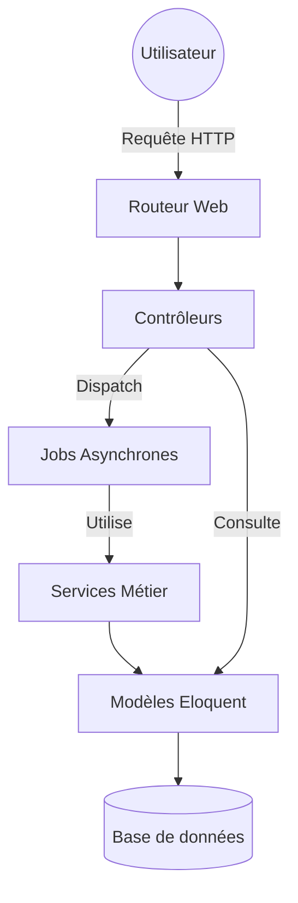

# Architecture de l'Application

Ce document détaille l'organisation logicielle de **SecureScan**, basée sur le framework Laravel, et explique le rôle de chaque composant majeur.

## 🏗️ Vue d'Ensemble

L'application suit une architecture **MVC (Modèle-Vue-Contrôleur)** enrichie par une couche de **Services** pour la logique métier complexe et des **Jobs** pour le traitement asynchrone.

---

## 🎮 Couche Contrôleurs (`app/Http/Controllers`)

Les contrôleurs gèrent la logique de navigation et orchestrent les actions utilisateur.

- **`ScanController`** : Le cœur de l'app. Gère la soumission des URLs, affiche l'état d'avancement (polling) et le tableau de bord des résultats.
- **`ScanHistoryController`** : Permet aux utilisateurs connectés de voir leurs anciens scans, de les relancer ou de les supprimer.
- **`AuthController`** : Gère l'inscription, la connexion et la déconnexion.
- **`PullRequestController`** : Gère l'interaction avec GitHub pour créer des Pull Requests de correction.
- **`LocaleController`** : Permet de basculer la langue de l'interface (Français/Anglais).

---

## 🛠️ Couche Services (`app/Services`)

Les services encapsulent la logique spécifique, permettant de garder les contrôleurs et les jobs légers.

### Services de Scan (Wrapper d'outils)
Chaque service exécute un outil spécifique et formate les résultats.
- **`SemgrepService`** : Analyse de code statique (SAST) multi-langages.
- **`EslintService`** : Détecte les erreurs et problèmes de sécurité en JavaScript/TypeScript.
- **`NpmAuditService`** : Vérifie les vulnérabilités dans les dépendances `npm`.
- **`TruffleHogService`** : Détecte les secrets (clés API, mots de passe) exposés dans le code.
- **`BanditService`** : Analyse de sécurité spécifique pour Python.

### Services d'Infrastructure
- **`GitCloneService`** : Gère le clonage sécurisé des dépôts dans des dossiers temporaires et leur nettoyage.
- **`GitHubPRService`** : Communique avec l'API GitHub pour automatiser les propositions de correction.
- **`OwaspMapperService`** : Traduit les codes d'erreurs des scanners vers la nomenclature standard **OWASP Top 10**.

---

## ⚡ Traitement Asynchrone (`app/Jobs`)

- **`RunSecurityScanJob`** : C'est le chef d'orchestre de l'analyse. Il est exécuté en arrière-plan par un worker. Sa mission est de :
    1. Cloner le code via `GitCloneService`.
    2. Lancer tous les `Services de Scan`.
    3. Fusionner les résultats.
    4. Enregistrer les données en BDD.
    5. Nettoyer les fichiers temporaires.

---

## 🎨 Frontend et Vues (`resources/views`)

L'interface est construite avec le moteur de template **Blade** et stylisé avec **CSS/Tailwind**.

- **`layouts/`** : Contient le gabarit principal avec la barre de navigation "Matrix".
- **`home.blade.php`** : Page d'accueil avec le formulaire de scan.
- **`dashboard.blade.php`** : Interface complexe utilisant **Chart.js** pour visualiser les résultats.
- **`loading.blade.php`** : Page d'attente interactive pendant que le job s'exécute en arrière-plan.

---

## 🧪 Interactions Clés

1. **Scan d'un dépôt** : `ScanController` créé le scan -> `RunSecurityScanJob` est dispatché -> Le Job utilise les `Services` -> Les données sont affichées via le `Dashboard`.
2. **Correction automatique** : L'utilisateur sélectionne une faille -> `PullRequestController` appelle `GitHubPRService` -> Une PR est ouverte sur GitHub.
