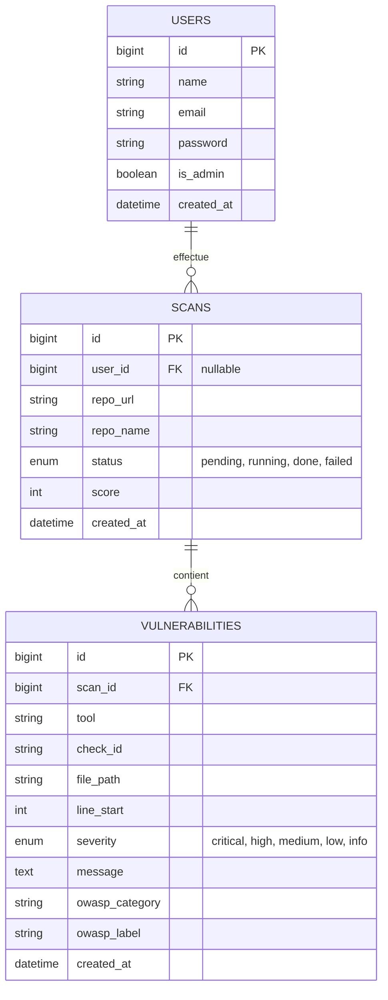

# Architecture de la Base de Données

Ce document détaille la structure de la base de données de **SecureScan** et comment l'application interagit avec elle pour traiter les scans de sécurité.

## 📊 Schéma Conceptuel (ERD)

### 🖼️ Vue Graphique du Schéma
Pour une vision plus détaillée des relations et des types de données, voici la représentation graphique générée :

## 🗄️ Description des Tables Principal

### 1. `users`
Stocke les informations des utilisateurs. L'application supporte le scan en mode "invité" (guest), donc la relation avec les scans est optionnelle.
- **is_admin**: Permet d'accéder à des fonctionnalités d'administration (ex: voir tous les scans).

### 2. `scans`
La table centrale qui suit l'état d'une analyse de dépôt GitHub.
- **repo_url**: L'URL source fournie par l'utilisateur.
- **status**: Gère le cycle de vie du scan (`pending` -> `running` -> `done`/`failed`).
- **score**: Un indice de sécurité de 0 à 100 calculé à la fin du scan.

### 3. `vulnerabilities`
Contient les résultats bruts trouvés par les différents scanners (Semgrep, Eslint, etc.).
- **scan_id**: Clé étrangère vers le scan parent.
- **severity**: Utilisée pour calculer le score final et pour le code couleur de l'interface.
- **owasp_category**: Catégorisation automatique pour l'affichage des statistiques.

---

## ⚙️ Interactions et Flux de Données

Le processus suit un flux asynchrone pour ne pas bloquer l'utilisateur pendant les analyses lourdes.

1.  **Soumission (`ScanController@store`)** :
    - L'utilisateur entre une URL GitHub.
    - Une entrée est créée dans `scans` avec le statut `pending`.
    - Un "Job" (`RunSecurityScanJob`) est envoyé dans la file d'attente (**Queue**).

2.  **Traitement en arrière-plan (`RunSecurityScanJob`)** :
    - Le worker Laravel récupère le job.
    - Le statut du scan passe à `running`.
    - Le dépôt est cloné localement.
    - Plusieurs outils de scan sont exécutés parallèlement.
    - Les résultats sont centralisés et insérés **en masse** (bulk insert) dans la table `vulnerabilities` pour optimiser les performances.

3.  **Finalisation** :
    - Le score est calculé en fonction du nombre et de la sévérité des failles dans `vulnerabilities`.
    - La table `scans` est mise à jour avec le `score` final et le statut `done`.
    - Le dossier local temporaire est supprimé.

4.  **Affichage (`ScanController@dashboard`)** :
    - L'interface récupère les données via Eloquent (`Scan::with('vulnerabilities')`).
    - Les statistiques sont agrégées dynamiquement (Group By Severity/OWASP) pour alimenter les graphiques.

---

## 🛠️ Tables de Service (Laravel)

Ces tables sont gérées automatiquement par le framework :
- **`jobs`** : Files d'attente pour le traitement asynchrone.
- **`failed_jobs`** : Historique des tâches qui ont échoué techniquement.
- **`sessions`** : Gestion de la persistance de connexion des utilisateurs.
- **`migrations`** : Suivi des versions de la structure de la base de données.
